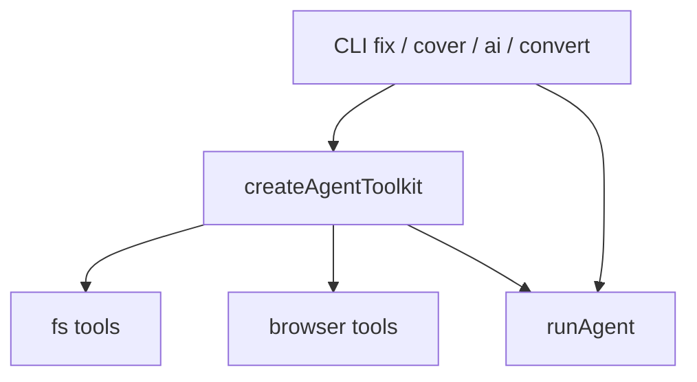

# AI codegen

Shared package: `untestutils/ai`. CLI workflows share one toolkit (filesystem + optional Playwright page tools).

## Architecture



## Workflows

| API / CLI | Role |
|-----------|------|
| `aiTest` / `untestutils ai` | Generate a spec from a prompt |
| `convertTestFile` / `untestutils convert` | Migrate an existing test file |
| `fixBrokenTests` / `untestutils fix` | Repair a failing test using the failure log (+ browser) |
| `coverMissingTests` / `untestutils cover` | Author missing high-value e2e tests |

## Shared tools

**Filesystem:** `list_dir`, `read_file`, `grep` (rooted, secret-safe).

**Browser (optional peer `playwright-core`):** `browser_goto`, `browser_snapshot`, `browser_content`, `browser_click`, `browser_eval`.

Enable with `--base-url` or `--browser` on CLI.

## Environment

| Env | Meaning |
|-----|---------|
| `UNTESTUTILS_AI=1` | Allow live LLM calls on cache miss |
| `UNTESTUTILS_AI_MOCK=1` | Deterministic mock for CI |
| `UNTESTUTILS_AI_PROVIDER` | `openai` \| `anthropic` \| `google` \| `xai` |
| `UNTESTUTILS_AI_MODEL` | Model id |

## CLI examples

```bash
# Fix a broken file by re-running the failing command
UNTESTUTILS_AI=1 untestutils fix tests/e2e/home.test.ts \
  --run "pnpm exec vitest run tests/e2e/home.test.ts" \
  --base-url http://127.0.0.1:3000

# Write missing tests while browsing a live app
UNTESTUTILS_AI=1 untestutils cover --recipes site --base-url http://127.0.0.1:3000
```

## Prompts

System prompts live under `packages/ai/src/prompts/`: `v1`, `convert-v1`, `fix-v1`, `cover-v1`.

## Next

- [CLI](/cli/)
- [API: AI](/api/ai)
