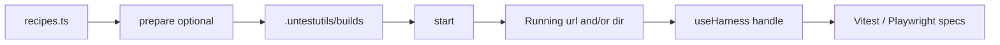

# Concepts

## Mental model

| Term | Meaning |
|------|---------|
| **Recipe** | Declarative target: optional `prepare`, required `start`, optional `ready` / `share` / `hashInputs` |
| **Driver** | Factory that returns a Recipe (`staticDir`, `nuxt`, `host`, …) |
| **Running** | Result of `start`: `{ kind: 'url', url, stop }` and/or `{ kind: 'dir', dir }` |
| **HarnessHandle** | What `useHarness` returns: `url?`, `dir?`, `$fetch`, `files.*`, `dispose?` |
| **Identity** | Hash of recipe id + inputs → cache key under `.untestutils` |

## Recipe lifecycle

1. **Register** — `defineRecipes({ id: recipe })` (or pass a Recipe object to `useHarness`).
2. **Prepare** (optional) — build/output into an artifact dir; skipped when cache is warm.
3. **Start** — bind a local server (or return a dir / remote URL).
4. **Ready** — HTTP (or custom) gate before specs run.
5. **Teardown** — stop processes; global teardown clears the registry.

Local servers bind to **`127.0.0.1`** (loopback), not `0.0.0.0`.

## Artifacts

- Default root: `.untestutils/` (override with `UNTESTUTILS_ARTIFACTS_DIR`).
- Builds, locks, host registry, AI caches live here.
- **Never** place artifacts inside a published package or workspace member dist.

## Share policy

Recipes can declare how aggressively prepared outputs are reused across workers. Escape hatches:

| Env | Effect |
|-----|--------|
| `UNTESTUTILS_SHARE=0` | Disable sharing |
| `UNTESTUTILS_DEBUG=1` | Verbose logs |
| `UNTESTUTILS_ARTIFACTS_DIR=…` | Custom artifacts root |

See [Sharing & cache](/guide/sharing-and-cache).

## Imports cheat sheet

| Import | Use in |
|--------|--------|
| `untestutils` | `defineRecipes`, drivers (`staticDir`, `host`, …) |
| `untestutils/vitest/plugin` | Vitest **config** only |
| `untestutils/vitest` | Specs (`test`, `useHarness`, fixtures) |
| `untestutils/playwright` | Playwright config + specs |
| `untestutils/nuxt` | `nuxt({ run })` factory |
| `untestutils/ai` | Codegen helpers |

## Next

- [Drivers & recipes](/guide/drivers)
- [Vitest](/guide/vitest)
- [API: Core](/api/core)
