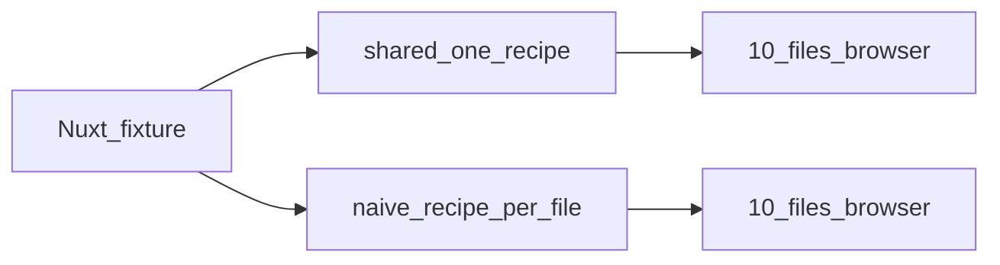

# Demo — mass Nuxt e2e

Same **browser** scenarios (Playwright `goto` + Nuxt hydration + clicks/cookies), two prepare strategies — **measured wall time**, not estimates.

Think [nuxt-i18n-next](https://github.com/s00d/nuxt-i18n-next)-scale: many files, real live Nuxt, not a 1s `$fetch` toy.

<DemoCompare />



## What is compared

| | Naive (`pnpm test:naive`) | Shared (`pnpm test:shared`) |
| --- | --- | --- |
| Recipe | `app01`…`app10` — one id **per file** | One `app` for all files |
| Prepare | Paid **per file** (cold artifacts wiped before capture) | **Once** (one recipe id, shared host) |
| Assertions | Same 150 browser flows | Same 150 browser flows |

## Try it

```bash
cd examples/mass-nuxt
pnpm generate:e2e
pnpm test:shared   # untestutils shared prepare
pnpm test:naive    # ordinary per-file prepare (slow)
```

Source: [`examples/mass-nuxt`](https://github.com/s00d/untestutils/tree/master/examples/mass-nuxt)

## Refresh captured results

```bash
pnpm run demo:capture
```

Runs **both** suites after wiping their artifact dirs, writes `docs/public/demo/{shared,naive}.log` + `results.json`. Not part of default `preflight` (naive is intentionally slow).

## Next

- [Why untestutils](/why)
- [Getting started](/guide/getting-started)
- [How it works](/guide/how-it-works)
