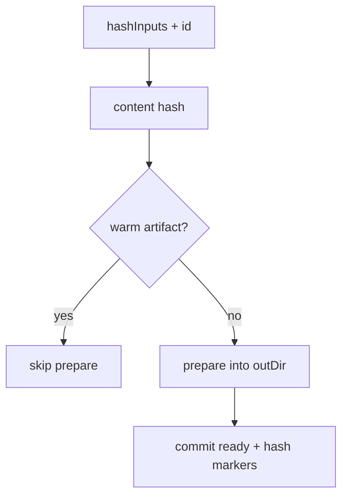

# Sharing and cache

untestutils avoids rebuilding the same Recipe on every file by caching **prepare** outputs under `.untestutils/builds` keyed by identity hash.

## Identity

Identity combines schema version, recipe id, and `hashInputs` (file contents, env, etc.). When inputs change, prepare runs again.



## Locks

`FileLock` serializes prepare across processes so parallel Vitest workers do not corrupt the same build dir. Stale locks from dead PIDs are recovered.

## Target registry

Running targets expose URLs via an on-disk registry / env (`UNTESTUTILS_HOST_<ID>`) so Playwright workers and Vitest setups resolve `baseURL` without re-starting servers unnecessarily.

## Playwright sessions

Give each Playwright config a `session` (or `artifactsRoot`) so its `globalTeardown` only drains that namespace:

```ts
createPlaywrightConfig({
  recipes,
  session: 'ci-pw-a', // → .untestutils/sessions/ci-pw-a
  prewarm: ['app'],
  workers: 2,
})
```

Parallel CI jobs with different sessions do not share `targets.json` and will not kill each other's servers. Vitest can keep the default `.untestutils` root while Playwright uses `sessions/…`.

## Share policy

Recipes may set `share` to control reuse. Force isolation:

```bash
UNTESTUTILS_SHARE=0 pnpm test
```

## CI tips

1. Cache `.untestutils/` between jobs when recipe inputs are stable (key on lockfile + fixture hashes).
2. Use `prewarm: […]` so the first test file does not pay cold start alone.
3. Always tear down (`globalTeardown` / process supervisor) to avoid orphan servers on runners.
4. Prefer absolute `recipesModule` paths in monorepos (Vitest cwd issues).

## Debug

```bash
UNTESTUTILS_DEBUG=1 pnpm exec vitest run
```

## Next

- [Remote host](/guide/remote-host)
- [Troubleshooting](/guide/troubleshooting)
- [Concepts](/guide/concepts)
